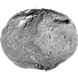
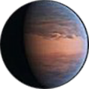
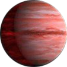

# exoplanetjs

> *Here be dragons!* This is a work in process. Not everything works. 


Collection of Javascript files and functions for use with Exoplanet data parsing/rendering/conversion.

## Installation

`npm install exoplanetjs --save`

## Usage

```javascript
const exoplanetjs = require('exoplanetjs');
console.log(exoplanetjs.data);
```

## Documentation

#### exoplanetjs.helpers Namespace

##### .getPlanetType(_jupiterMassAsFloat_)

Returns an `{}`. the calculated PlanetType. References `exoplanet.data.PlanetTypeCollection` for the type to return.

##### .toEarthMass(_jupiterMassAsFloat_)

Returns a `float` that represents how many Earth masses a Jupiter mass would correspond to.

#### exoplanetjs.data Namespace

##### .PlanetTypesCollection

Returns an `[]` of `{}` that represent official NASA planetary body types. Each sub `{}` contains the following attributes: `minMass: (Float)`, 
                                                                                                                          		`maxMass: (Float)`, & 
                                                                                                                          		`desc: (String)`

## Work in Progress

There is still very limited functionality to this project. More documentation will be added as we go.

## Exoplanet Assets

Included in this project are various exoplanet resources. These have been sources from data found on NASA and ESA websites.

 Asteroidan Planet

 Mercurian Planet

 Subterran Planet

 Terran Planet

 Superterran Planet

 Neptunian Planet

 Jovian Planet
